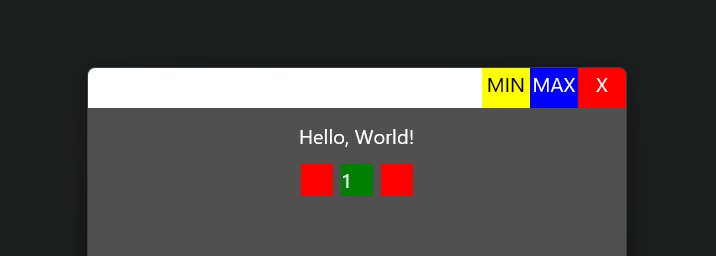

## Window Control Area

Setting the `window_control_area` on an element allows gpui to create actions on that element for dragging, minimizing, maximizing and closing the window.

This allows you to create a custom Headbar for your application.

### Hiding the default window decorations

```rust
let win_options = WindowOptions {
    // This hides the window decorations on Linux. Server -> X11/Wayland, Client -> Your app
    window_decorations: Some(gpui::WindowDecorations::Client),
    titlebar: Some(TitlebarOptions {
        // This hides the window decorations on Windows and MacOS
        appears_transparent: true,
        ..Default::default()
    }),
    ..Default::default()
};
```

### Simple window decoration example

```rust
#[derive(IntoElement)]
struct HeaderBar;
impl RenderOnce for HeaderBar {
    fn render(self, _window: &mut Window, _cx: &mut App) -> impl IntoElement {
        div()
            .flex()
            .h_10()
            .w_full()
            .bg(Colors::dark().background)
            .child(
                // This element stretches over the available space on the left
                div()
                    .h_10()
                    .flex_1()
                    .bg(gpui::white())
                    // IMPORTANT: Don't put this on the most outer element! The most outer `window_control_area` will overwrite it!
                    .window_control_area(gpui::WindowControlArea::Drag),
            )
            .child(
                div()
                    .h_10()
                    .w_12()
                    .bg(gpui::yellow())
                    .text_center()
                    .text_color(gpui::black())
                    .window_control_area(gpui::WindowControlArea::Min)
                    .child("MIN"),
            )
            .child(
                div()
                    .h_10()
                    .w_12()
                    .bg(gpui::blue())
                    .text_center()
                    .window_control_area(gpui::WindowControlArea::Max)
                    .child("MAX"),
            )
            .child(
                div()
                    .h_10()
                    .w_12()
                    .bg(gpui::red())
                    .text_center()
                    .window_control_area(gpui::WindowControlArea::Close)
                    .child("X"),
            )
    }
}
```

This example will produce a Titlebar that can control the window and looks like this.


